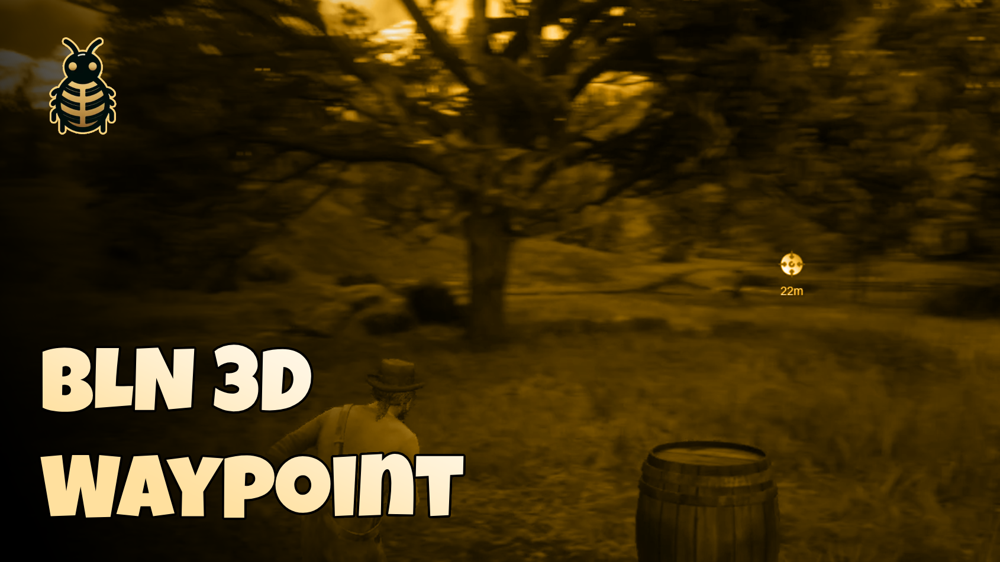
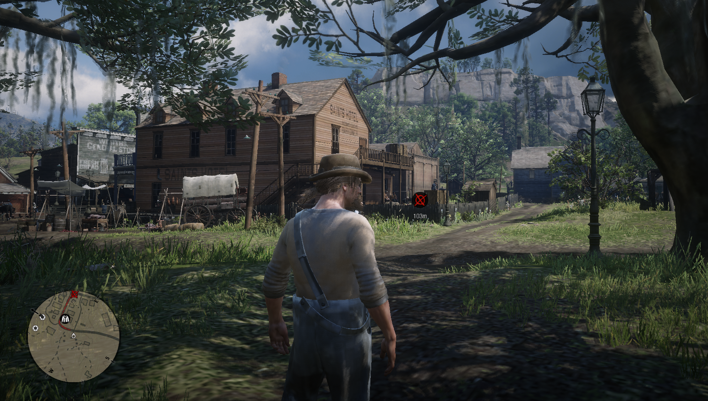

# 3D Waypoint Indicator for RedM 🎯


<div style="display: flex; justify-content: space-between;">
    
</div>

A sleek and performant waypoint indicator system that shows a dynamic 3D marker pointing to your destination.

## Features ⭐
- Real-time 3D position tracking 🎮
- Dynamic distance indicator 📏
- Automatic waypoint detection 🗺️
- Custom destination support via exports 🔧
- Toggle command for player preference ⚡
- Configurable blip styles and colors 🎨
- Performance optimized 🚀
- No external dependencies required 📦

## Preview
[Video Preview](https://youtu.be/OyLcVwynbtI)

## Installation 🛠️
1. Download the resource
2. Place it in your resources folder
3. Add `ensure bln_3d_waypoint` to your `cfg` file

## Usage 🎯

### Basic Usage
1. Open your map
2. Set a waypoint anywhere
3. The 3D indicator will automatically appear and guide you!

### Commands
- `/togglewaypoint` - Enable/disable the waypoint indicator

### For Developers
```lua
-- Set custom destination with custom blip and color
exports['bln_3d_waypoint']:SetCustomDestination({
    x = 123.4,
    y = 567.8,
    z = 90.0  -- optional
}, "blip_name", {255, 0, 0})

-- Remove custom destination
exports['bln_3d_waypoint']:RemoveCustomDestination()

-- or using events
TriggerEvent('waypointIndicator:setDestination', coords, blipName, blipColor)
TriggerEvent('waypointIndicator:removeDestination')
```

## Performance 📈
- Optimized native draws
- Ground Z coordinate caching
- Smart update cycles
- Minimal resource usage
- Smooth real-time tracking

## Support 💬
Need help? Join our Discord server:
[Join Discord](https://discord.com/invite/MEZRYQVpnt)

## Credits 🙏
Created by [BLN Studio](https://bln.tebex.io)

Feel free to contribute to this project! ⭐